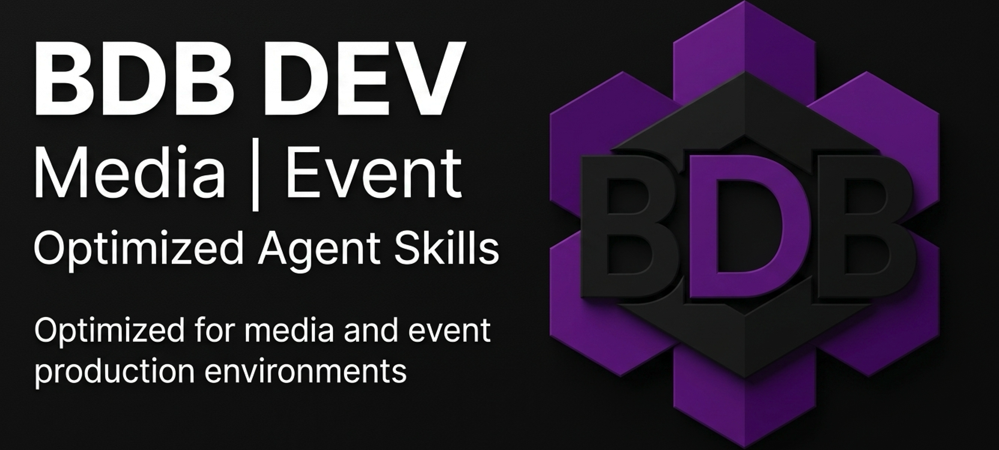

🌐 **Sprache / Language / Idioma**: [ 🇬🇧 English ](README.md) | **Deutsch** | [ 🇵🇹 Português ](README.pt.md)

---

# 🚀 BDB DEV - Optimiertes Creative & Full-Stack Skills Pack

[](https://github.com/hybridlabor-api/bdb-dev-optimized-agent-skills-basic/actions)
[](https://www.npmjs.com/package/@hybridlabor-api/bdb-dev-optimized-agent-skills-basic)
[](https://github.com/hybridlabor-api/bdb-dev-optimized-agent-skills-basic)
[](LICENSE)
[](https://github.com/hybridlabor-api/bdb-dev-optimized-agent-skills-basic)

> **Maximale Power für KI-Coding-Agenten: 144 hochkuratierte Skills, 22 lokale MCPs und tiefgreifende Integrationen für Creative Technologies und Software Engineering.**

Willkommen im **BDB DEV Skills & MCP Configuration** Repository. Dieses Projekt bildet das Rückgrat unseres Entwicklungs-Ecosystems. Es erweitert KI-Agenten um hochspezialisierte Fähigkeiten für die Event- und Medienbranche sowie klassische Software-Entwicklung.

Optimiert für **Google Antigravity**, ist dieses Paket **100% universell** und kompatibel mit allen modernen KI-Agenten (einschließlich **Claude Desktop, Claude Code, Cursor, Aider, Roo Code, Cline und Windsurf**).

---

## 🌟 144 Optimierte Skills

Aus über 1.400 Skill-Vorlagen haben wir nach intensiven Tests die **144 effektivsten Skills** destilliert (inklusive der nativen OpenWiki-Engine in v1.3.3 und dem **memB Semantic Memory Brain in v2.0.0**).

Diese Skills sind präzise optimiert, damit KI-Agenten keine Zeit mit redundanten Aufgaben verschwenden, sondern mit maximaler Autonomie und Kontextbewusstsein agieren.

### 💻 Jenseits von Events: Software & App Development
- **Full-Stack Development**: Next.js App Router Boilerplates, skalierbare Node.js Microservices und interaktive Web-Apps.
- **App Engineering**: Datenbank-Architektur, REST APIs und plattformübergreifende Anwendungen.
- **Design & QS**: UI/UX Audits via `ui-ux-pro-max`, Clean Code Prinzipien und CI/CD Pipelines.

---

## 🔄 BDB Software Engineering Pipeline & Slash-Befehle

```text
 IDEATE          DEFINE         PLAN           BUILD          VERIFY         SHIP
 ┌──────┐      ┌──────┐      ┌──────┐      ┌──────┐      ┌──────┐      ┌──────┐
 │ Grill│ ───▶ │ Idea │ ───▶ │ Spec │ ───▶ │ Code │ ───▶ │  QA  │ ───▶ │  Go  │
 │  Me  │      │Refine│      │  PRD │      │ Impl │      │ Gate │      │ Live │
 └──────┘      └──────┘      └──────┘      └──────┘      └──────┘      └──────┘
/grill-me    /bdbrainstorm     /plan        /subagents      /review       /ship
```

1. **IDEATE (`/grill-me`)**: Interaktives Interview zur Schärfung der Projektidee und Aufdeckung von Schwachstellen.
2. **DEFINE (`/bdbrainstorm`)**: Multi-Agenten Brainstorming (UI/UX Visionär, Tech Architekt, Devil's Advocate).
3. **PLAN (`/plan`)**: Technische Spezifikation, PRD und dateiweise Entwicklungspläne nach `ui-ux-pro-max` Standards.
4. **BUILD (`/subagents`)**: Orchestrierung eigenständiger Subagenten zur parallelen Code-Erstellung.
5. **VERIFY (`/review`)**: QA-Reviews, Sicherheits-Scans, Unit-Tests und UI/UX Audits.
6. **SHIP (`/ship`)**: Automatisierte Commits, OpenWiki-Updates und Live-Deployment.

---

## 🧠 BDBrainstorm: Die Ultimative Ideations-Engine

Teil dieses optimierten Arsenals ist unsere proprietäre **BDBrainstorm** Skill. Wenn Sie Ideen durchdenken oder Architekturentscheidungen validieren möchten, rufen Sie einfach `/bdbrainstorm` oder `/grill-me` auf.

---

## 🔌 22 Custom Lokale MCP Integrationen

Dieses Repository enthält **22 spezialisierte lokale MCP-Wrapper** (im Ordner `mcps/`), mit denen KI-Agenten führende Software steuern können:
- **Adobe Creative Cloud (`bdb_adobe_mcp`, `bdb_adobe_uxp_mcp`)**: Photoshop, Premiere, After Effects, Illustrator.
- **DaVinci Resolve (`bdb_davinci_mcp`, `bdb_davinci_mcp_studio`)**: Videoschnitt, Color Grading, Fusion & KI-Voice-Isolation.
- **Rhino 3D & Grasshopper (`bdb_rhino_mcp`)**: Parametrische 3D-Geometrie.
- **Unreal Engine 5 (`bdb_unreal_mcp`)**: Web Remote Control API, Actor Spawning & Blueprint Automation.
- **TouchDesigner (`bdb_touchdesigner_mcp`)**: Realtime Media & Node Network Control.
- **Blender, grandMA3, Resolume & Vectorworks**: Vollwertige Steuerung von 3D, Lichtpulten, Medienservern und CAD.
- **memB Semantic Brain (`memb_mcp`)**: Lokales, offlinetaugliches Vektor-Gedächtnis.

---

## 📖 11 Spezialisierte System Skills

- [`bdb-unreal-mcp.md`](skills/global_config/bdb-unreal-mcp.md)
- [`bdb-rhino-mcp.md`](skills/global_config/bdb-rhino-mcp.md)
- [`bdb-davinci-mcp.md`](skills/global_config/bdb-davinci-mcp.md)
- [`bdb-blender-mcp.md`](skills/global_config/bdb-blender-mcp.md)
- [`bdb-after-effects-mcp.md`](skills/global_config/bdb-after-effects-mcp.md)
- [`bdb-vectorworks-mcp.md`](skills/global_config/bdb-vectorworks-mcp.md)
- [`bdb-touchdesigner-mcp.md`](skills/global_config/bdb-touchdesigner-mcp.md)
- [`bdb-computer-use-mcp.md`](skills/global_config/bdb-computer-use-mcp.md)
- [`bdb-grandma3-mcp.md`](skills/global_config/bdb-grandma3-mcp.md)
- [`bdb-resolume-mcp.md`](skills/global_config/bdb-resolume-mcp.md)
- [`bdb-adobe-suite-mcp.md`](skills/global_config/bdb-adobe-suite-mcp.md)
- [`bdb-memb-mcp.md`](skills/global_config/bdb-memb-mcp.md)
- [`openwiki-skill`](skills/global_config/openwiki-skill/SKILL.md)
- [`memb-skill`](skills/global_config/memb-skill/SKILL.md)
- [`github-repo`](skills/global_config/github-repo/SKILL.md)

---

## ⚡ Installation & Optionen

```bash
# Automatische Installation via NPX (unterstützt Antigravity, Claude, Cursor, Windsurf)
npx @hybridlabor-api/bdb-dev-optimized-agent-skills-basic@latest -y
```

---

## 📚 Dokumentation

Detaillierte Dokumentation, Architekturpläne und Release Notes finden Sie im [.openwiki/](.openwiki/quickstart.md) Verzeichnis.
